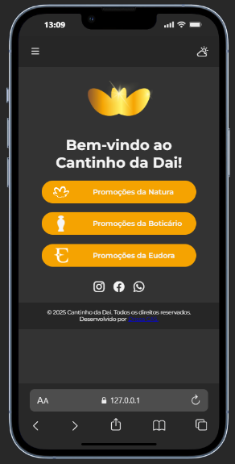

# 🌸 Link da Bio – Cantinho da Dai

Este projeto é um **mini site pessoal** desenvolvido para ser utilizado como link da bio no Instagram da loja *Cantinho da Dai*. Seu objetivo é centralizar os links das principais marcas com as quais a loja trabalha, permitindo que os clientes acessem promoções de forma rápida, prática e intuitiva diretamente pelo celular.

---

## 🚀 Deploy

O projeto estará disponível em breve...

---

## 🎯 Objetivo do Projeto

- Centralizar o acesso às promoções das marcas parceiras da loja
- Criar uma experiência rápida e mobile-first para os clientes
- Substituir o uso de múltiplos links no Instagram por um único link inteligente
- Implementar **modo claro e escuro (dark mode)** com JavaScript

---

## 🛠 Tecnologias Utilizadas

| Tecnologia | Descrição |
|-----------|-----------|
| **HTML5** | Estrutura do projeto |
| **SASS/SCSS** | Estilização avançada com variáveis e mixins |
| **JavaScript** | Alternância de tema (dark/light mode) em desenvolvimento |
| **Figma** | Base para o design visual |

---

## 📷 Preview do Projeto

---

